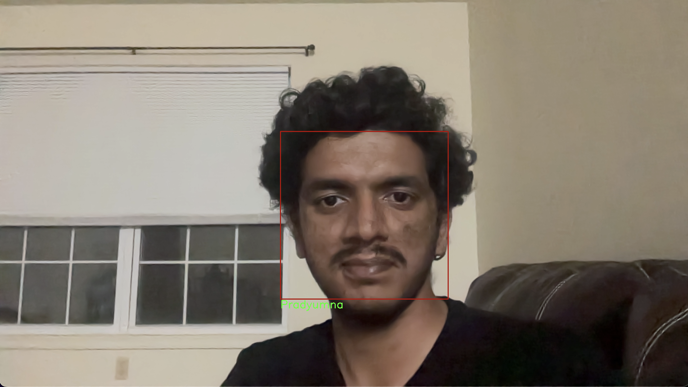

# Face Detection and Recognition

This project demonstrates how to create a dataset, train a model, and detect faces in real-time using a webcam. The process involves capturing images through a live camera feed, storing them in a dataset, training a model, and using it to detect faces with labels.

## Steps to Run the Project

### 1. Download the Haarcascade File

Download the `haarcascade_frontalface_default.xml` file from the following link:  
[haarcascade_frontalface_default.xml](https://github.com/kipr/opencv/blob/master/data/haarcascades/haarcascade_frontalface_default.xml)

### 2. Create the Dataset

Run the following command to capture images through your webcam and store them in the `dataset` folder:

```bash
python3 dataset_creator.py

### 3. Train the Model

After creating the dataset, follow these steps to train the face recognition model:

**Run the Trainer Script:**

Run the following command to train the model:

```bash
python3 trainer.py

**Training Output:**

The script will process the images from the dataset folder and generate the trained model, which will be used for face detection.

### 4. Detect Faces in Real-Time

To detect faces in real-time, follow these steps:

**Run the Detector Script:**

Use the following command to detect faces using your webcam:

```bash
python3 detector.py

**Real-Time Detection**

The script will access your webcam, detect faces, and display them with labels in real-time.

### Sample Output

Upon successful execution, the output will resemble the following image:




